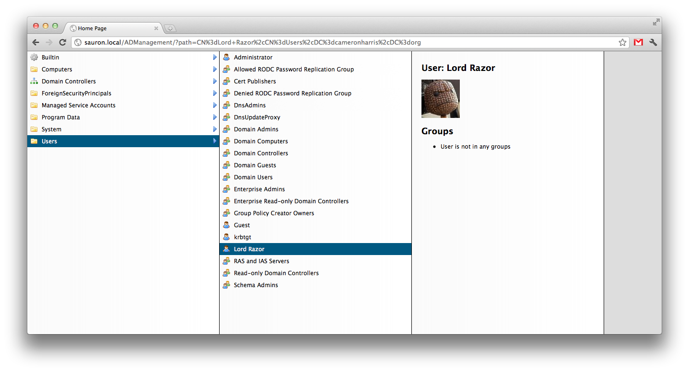

Basic AD explorer

1. Use NuGet to install dependencies (see: http://blog.davidebbo.com/2011/03/using-nuget-without-committing-packages.htm)
2. Set your LDAP path in the Web.config
3. Build in VS2010 
4. Run!

